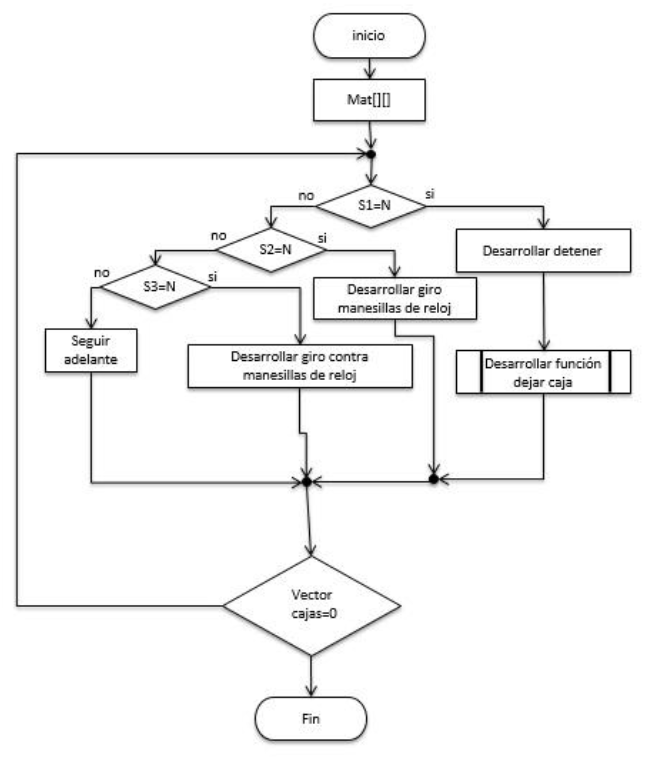

# Manejo de Trayectoria de Robot en C++
Este fue el primero proyecto de la asignatura Software de Procesadores en el periodo 2016-3 de la carrera de Ingeniería Electrónica en la Pontificia Universidad Javeriana de Bogotá D.C., Colombia. 

## INFORME PROYECTO N° 1

## CONTENIDO

Introducción

1. Objetivos
2. Diagramas de flujo
    2.1. Control del sistema de desplazamiento de la plataforma
    2.2. Control del sistema de manipulación de materiales
3. Codificación en c/c++.
    3.1. Control del sistema de desplazamiento de la plataforma:
       3.1.1. Void Desplazamiento_Avanzar.
       3.1.2. Void Desplazamiento_Detener.
       3.1.3. Void Desplazamiento_Rotar_AgujasReloj.
       3.1.4. Void Desplazamiento_Rotar_Opuesto_AgujasReloj
       3.1.5. Char S1_Lectura.
       3.1.6. Char S2_Lectura.
       3.1.7. Char S3_Lectura.
3.2. Control del sistema de manipulación de materiales:
3.2.1. Void Materiales_ArrojarCubo.
3.2.2. Void Materiales_No_Arrojar_Cubo.
3.2.1. Char S1_Lectura.
3.2.2. Char S4_Lectura.
3.2.3. Char S5_Lectura.
3.2.4. Char S6_Lectura.
3.2.5. Char S7_Lectura.
4. Loop Fusion.
5. Roles finales de cada uno de los integrantes.
6. Gráficos de las diferentes situaciones a las que se enfrenta el robot.

Conclusiones.

Referencias.


## INTRODUCCION

El mundo de la tecnología electrónica está en expansión constante desde hace ya un buen
tiempo. Como ya sabemos, la tecnología ayuda a que el humano pueda desarrollar sus
actividades diarias de una manera más sencilla, facilitando sus deberes y disminuyendo el
esfuerzo que éste tiene que desempeñar para cumplir dichas labores. Como ejemplo está
el arco y la flecha que como sabemos mejoró increíblemente la efectividad en la caza del
hombre primitivo. Ocurre lo mismo con la tecnología electrónica, cada día está en
expansión, cada día se conoce una nueva tecnología que supera a la anterior y reordena la
manera en la cual vemos el mundo. De las calculadoras robustas que solo podían hacer
operaciones elementales, a las actuales calculadoras capaces de hacer integrales tanto
teórica como numéricamente en un tiempo muy corto. De los grandes y un poco pesados
celulares a los actuales “ _Smartphone_ ” capaces de una y otra tarea que nos deja perplejos.
El avance de ésta tecnología se debe a la capacidad intelectual del ser humano, que de una
manera u otra logra llevar éstas hazañas de la idea al hecho. Éste proyecto está dirigido a
una de las máquinas que se ven mucho en la actualidad, los “ _robots”_ , que cada vez son más
y más avanzados y sofisticados para hacer varias labores según el uso que se les vaya a dar.
Aunque no vamos a entrar en detalle con cosas físicas como construir un “ _robot”_ que
cumpla una labor, vamos a hacer énfasis a una de las cosas más importantes (Sino la más
importante) que se tiene que tener en cuenta a la hora de utilizar un “ _robot”_ , y esto es su
programación. Lógicamente no haremos énfasis a una programación parecida a lo que fuera
una que en realidad fuese de un “ _robot”_ de la vida real, ya que no estaremos interactuando
con ningún objeto que se adecúe a la construcción de tal, sino que estudiaremos lo más
parecido a un escenario de lo que sería su programación, como estudiar diagramas de flujo
y sus respectivas simulaciones en código en lenguaje C/C++.


## 1. OBJETIVOS

 Hacer un análisis y soluciones detalladas de problemas planteados acerca de las
funcionalidades básicas de un Robot.
 Hacer diagramas de flujo y su respectiva representación en código del mecanismo
de movimiento de un robot y aparte una posible implementación de éste en el
campo de trabajo.
 Dar cumplimiento a las peticiones de Construcciones Robotizadas SAS, entregándole
un software que implementará la solución final que requiere dicha compañía para
controlar su robot.
 Desarrollarse en el ámbito profesional al enfrentarse a proyectos de calidad de
ingeniería que requiere de una dedicación y sacrificio de cada uno de los integrantes
del grupo de trabajo.


## 2.DIAGRAMAS DE FLUJO

**2.1. Control del sistema de desplazamiento de la plataforma**

**2.2. Control del sistema de manipulación de materiales.**


## 3.CODIFICACION EN C/C++.

**3.1. Control del sistema de desplazamiento de la plataforma:**

**3.1.1. Void Desplazamiento_Avanzar:**
Inicialmente utilizamos una matriz de 10x10 para representar la trayectoria a seguir del
robot. La zona por la cual el robot va a transitar está marcada con un guion al piso ‘_ ‘, (Los
guiones representan también a los puntos en negro por los cuales el robot puede circular),
y el resto de por donde el robot no circularía está marcado con un punto ‘.’, (representa los
puntos blancos por los cuales el robot no puede circular), en la figura número 1 se puede
observar nuestro prototipo de la trayectoria.

```
Figura 1. Representación de la
trayectoria del robot.
```
A partir de ésta trayectoria, comenzamos con lo que sería la función a la que llevaría el
avance del robot de la cual su nombre, “Desplazamiento_Avanzar”. Un contador llamado
“dirección”, es nuestro guía para poder hacer el movimiento del robot. Resulta que con un
par de funciones se va a determinar hacia a donde el robot tiene que moverse, supongamos
estamos en el punto (0,0) de la matriz, a la derecha hay un punto, eso le muestra al código
que la siguiente dirección no puede ser hacia la derecha ya que no está en la trayectoria, y
que, si debe hacerlo hacia abajo ya que hay un guion al piso o un punto en negro, que
respectivamente el sensor s1 detectaría.


En el ejemplo anterior, en el que el robot se encuentra en la posición número (0,0), el robot
no puede moverse ni a la derecha ni hacia la izquierda ni hacia arriba, sólo hacia abajo. Así
que nuestra solución es asignarle un valor a la variable “dirección”, para que cuando se
determine hacia a donde hay que mover el robot, a ésta variable se le agregue un valor
entre 1 y 4 para designar el movimiento. A la variable dirección se le va a asignar el valor de
1, si el siguiente movimiento es hacia la derecha, 2 si es hacia la izquierda, 3 si es hacia abajo
y 4 si es hacia arriba. En las figuras número 2,3,4 y 5 respectivamente se pueden apreciar
en código como se vería representaría el movimiento del robot.

```
Figura 2. Representación en código de
un movimiento hacia la derecha.
```
Para un respectivo movimiento hacia la izquierda se haría lo que ilustra la figura 3.

```
Figura 3. Representación en código de
un movimiento hacia la derecha.
```

Para un respectivo movimiento abajo se haría lo que ilustra la figura 4.

```
Figura 4. Representación en código de
un movimiento hacia abajo.
```
Para un respectivo movimiento abajo se haría lo que ilustra la figura 4.

_Figura 5. Representación en código de
un movimiento hacia abajo._
Nótese que cada vez que el robot va a hacer un movimiento, la variable booleana que queda
en verdadero o “ _true”_ es la que designa hacia qué dirección se va a mover el robot. Para el
ejemplo de si el robot se encuentra en el punto (0,0), en el que el movimiento es hacia
abajo, pues a la variable “dirección” se le asignaría un valor de 1, y la variable booleana
derecha sería la única que estaría en “ _true”_ (ver figura 2)_._


**3.1.2. Void Desplazamiento_Detener:**

Un punto crucial cuando hay que tratar con robots que van a hacer recorridos es poder
llevar un control de cuando el robot tiene que detenerse. La función
_“_ **Desplazamiento_Detener”,** es la encargada de hacer ésta tarea. Para hacer ésta función
lo que utilizamos fueron los mismos booleanos de dirección, (derecha, izquierda...etc.), ya
cambiados actualizados y cambiados de valor por la función anterior lo que ocurre es que
cuando lse ingresa a la función “ **Detener”,** va a empezar a comparar las variables booleanas
de dirección para saber hacia a donde hay que mover el carro. Una vez sepa hacia a donde
lo que va a hacer es verificar en la matriz plataforma si en el siguiente movimiento que haga
el robot habrá o no una estación. Para saber esto por medio de un par de funciones a la
matriz plataforma se le asignaron datos en representación de una letra ‘n’, en la cual están
las estaciones, si en un punto en específico hay un carácter ‘n’ en vez de un ‘b’, quiere decir
que en ése punto hay una estación y que por lo tanto el robot tiene que detenerse. En las
figuras 6,7,8,9 se muestra lo que realiza la función detenerse.

_Figura 6. Representación de como el robot debe trasladarse o detenerse.
Cuando el siguiente movimiento es a la derecha._
En la figura 6, anteriormente mostrada, se puede observar que cuando el movimiento es
hacia la derecha, en el código se hacen otros dos condicionales, en los que se verifica si en
la siguiente posición el robot debe seguir con su trayectoria y girar hacia la derecha o
detenerse en la estación.


_Figura 7. Representación de si el robot debe trasladarse o detenerse.
Cuando el siguiente movimiento es hacia la izquierda._
En la figura 7 anteriormente mostrada, se puede notar que cuando la siguiente dirección es
hacia la izquierda, se vuelve a verificar si en el siguiente movimiento hay o no una estación,
por lo cual el robot debe parar y en caso de que no seguir su trayecto.

_Figura 8. Representación de si el robot debe trasladarse o detenerse.
Cuando el siguiente movimiento es hacia arriba._
En la figura 8 anteriormente mostrada, se puede notar que cuando la siguiente dirección es
hacia la arriba, se vuelve a verificar si en el siguiente movimiento hay o no una estación, por
lo cual el robot debe parar y en caso de que no seguir su trayecto.

```
Figura 9. Representación de si el robot debe trasladarse o detenerse.
Cuando el siguiente movimiento es hacia abajo.
```

Finalmente, en la figura 9 anteriormente mostrada, se puede notar que cuando la siguiente
dirección es hacia la abajo, se vuelve a verificar si en el siguiente movimiento hay o no una
estación, por lo cual el robot debe parar y en caso de que no seguir su trayecto.

**3.1.3. Void Desplazamiento_Rotar_Agujas_Del_Reloj:**

Otro de las cosas importantes a la hora de utilizar un robot es la implementación a la hora
de girar, para ésta función, por su nombre podríamos intuir que es cuando se requiera que
gire hacia la derecha o en el sentido de las agujas del reloj. Para representar ésta función lo
que hacemos es que cuando los booleanos anteriormente actualizados de valor lleguen a
ésta función, va a empezar a compararlos y cada vez que se encuentre con un valor positivo
imprimirá, “Giró hacia la derecha” y va a cambiar el valor de dirección para hacer saber que
se ha desplazado. En la figura 10, se puede observar de una manera más clara el enfoque
de ésta función.

```
Figura 10. Representación cómo se mostraría el movimiento en
sentido de las agujas del reloj, del movimiento del robot.
```

Nótese que en cada uno de los booleanos que sea el que esté en “ _true”_ , va a imprimir giró
a la derecha, esto se debe a la funcionalidad de la función.

**3.1.4. Void Desplazamiento_Rotar_Opuesto_Agujas_Del_Reloj:**

Igual que en el caso anterior otro mecanismo muy importante a la hora de practicar con un
robot es a la hora de girar hacia la izquierda o al contrario de las manecillas del reloj. Para
esto se hizo lo mismo que en la función anterior solamente que cambiando en vez de “giró
a la derecha” por “giró a la izquierda”.

```
Figura 11. Representación cómo se mostraría el movimiento en
sentido de las agujas del reloj, del movimiento del robot.
```
En la figura 11, anteriormente mostrada se puede analizar cómo cambia en un poco la
estructura de ésta figura a la de la anterior. Aunque en un poco mínimo el cambio, en la
práctica sería algo considerable.


**3.1.5. Char S1_Lectura:**

Otro factor a tener en cuenta es la manera en la cual el robot se movería en un entorno un
poco más real. En el programa las direcciones son tomados como booleanos. La función
“Char S1_Lectura”, nos ayuda para saber el color que el robot está leyendo en el sensor 1.
Cuando el color a retornar sea negro el robot seguirá normal su trayecto, pero cuando sea
blanco quiere decir que la línea cambio de rumbo y verificar con los sensores 2 y 3
(encargados de un movimiento hacia la izquierda y derecha respectivamente. En la figura
12 y 13 se puede observar de una manera más clara como hace el robot esta operación.

```
Figura 12. Representación función Char1_ lectura
Cuando el movimiento es hacia la derecha e izquierda.
```
En la figura 12 se puede observar como el robot hace lo nombrado anteriormente, para los
casos de derecha e izquierda revisa si en la siguiente posición hay un carácter ‘n’, que le
indique girar, por lo tanto, lo retornará de lo contrario, retornará ‘b’, o sea que por ahí no
puede circular.


```
Figura 13. Representación función Char1_ lectura
Cuando el movimiento es hacia arriba o abajo
```
En la figura anterior se puede observar lo que sucede cuando el robot se va a diriir hacia la
abajo o hacia arriba. En éste caso vuelve a hacer lo mismo que ocurrió anteriormente, revisa
en que trayectoria está el robot y dependiendo de ésta verificará si debe o no avanzar.

**3.1.6. Char S2_Lectura:**

La función charS2_Lectura.Ésta función es la que nos retorna lo que está leyendo el sensor

2. En las imágenes 14 y 15 se puede apreciar cómo funciona.

```
Figura 14. Representación función Char1_ lectura
Cuando el movimiento es hacia derecha o izquierda
```

En la figura 14 se puede observar como el robot hace lo nombrado anteriormente, para
los casos de derecha e izquierda revisa si en la siguiente posición hay un carácter ‘n’, que
le indique girar, por lo tanto, lo retornará de lo contrario, retornará ‘b’, o sea que por ahí
no puede circular.

```
Figura 15. Representación función Char1_ lectura
Cuando el movimiento es hacia arriba o abajo
```
En la figura anterior se puede observar lo que sucede cuando el robot se va a dirigir hacia
la abajo o hacia arriba. En éste caso vuelve a hacer lo mismo que ocurrió anteriormente,
revisa en que trayectoria está el robot y dependiendo de ésta verificará si debe o no
avanzar.

3.1.7. Char S3_Lectura:

La función charS3_Lectura.Ésta función es la que nos retorna lo que está leyendo
el sensor 3. En las imágenes 16 y 17 se puede apreciar como funciona.


_Figura 16. Representación función Char1_ lectura
Cuando el movimiento es hacia arriba o abajo_
En la figura 17 se puede observar como el robot hace lo nombrado anteriormente, para
los casos de derecha e izquierda revisa si en la siguiente posición hay un carácter ‘n’, que
le indique girar, por lo tanto, lo retornará de lo contrario, retornará ‘b’, o sea que por ahí
no puede circular.

_Figura 17. Representación función Char1_ lectura
Cuando el movimiento es hacia arriba o abajo_
En la figura anterior se puede observar lo que sucede cuando el robot se va a dirigir hacia
la abajo o hacia arriba. En éste caso vuelve a hacer lo mismo que ocurrió anteriormente,
revisa en que trayectoria está el robot y dependiendo de ésta verificará si debe o no
avanzar.


**3.2. Control del sistema de manipulación de materiales:**

```
3.2.1. Void Materiales_ArrojarCubo.
```
Unos de los factores importantes a la hora de la implementación del robot es a la hora en
la cual tiene que tiene que saber cuándo tiene que arrojar un cubo. La función
“Materiales_ArrojarCubo”, es la encargada de ésta acción. En la figura 18 se puede observar
a la función “Materiales_ArrojarCubo”.

_Figura 18. Representación función Materiales_ArrojarCubo_
Lo que hace ésta función, es que cuando entra al primer condicional (Ver figura 18 ), lo que
va a hacer es que una variable booleana “entregar_caja”, se convierta en “ _true”,_ de ésta
manera se sabe que hay que entregar una caja en éste momento, y lo que va a hacer
después es mover la posición del vector una posición por iteración y a la última posición le
va a asignar un valor de 0, para que así sepa que ya se entregó la caja actual y faltan algunas.
Por ejemplo:

```
Figura 19. Representación de lo que sucede en la función.
```

En la figura 19, se puede observar lo que sucede con el vector “banda_transportadra”. Éste
vector es el encargado de mostrarnos en cual estación debe ir la caja. Si observamos el
ejemplo anterior en la posición 0 del vector, hay un numero 1, por éste motivo sabemos
que para la primera caja, el robot tiene que dejarla o arrojarla en la estación 1, al moverse
de posiciones el arreglo, la siguiente caja no sería la 1 sino la 2, y precisamente iría hacia la
estación 2. Finalmente, lo que haría la función es a la última posición agregarle un 0, ya que
es una caja que ya no está dentro del arreglo o es una caja que el robot ya habría arrojado.

```
3.2.2. Void Materiales_No_Arrojar_Cubo.
```
Ésta función es un poco simple, cuando el robot no necesite detenerse para dejar una caja
simplemente seguirá con su trayectoria y no habrá cambios. Sería lo mismo que
simplemente llamar a la función avanzar.

```
Figura 20. Función Materiales_No_ArrojarCubo.
```
**3.2.3. Char S1_Lectura:**

La función “Char S1_Lectura”, nos ayuda para saber el color que el robot está leyendo en el
sensor 1. Cuando el color a retornar sea negro el robot seguirá normal su trayecto, pero
cuando sea blanco quiere decir que la línea cambio de rumbo y verificar con los sensores 2
y 3 (encargados de un movimiento hacia la izquierda y derecha respectivamente. En la figura
22 y 23 se puede observar de una manera más clara como hace el robot esta operación.


_Figura 22. Representación función Char1_ lectura
Cuando el movimiento es hacia la derecha e izquierda._
En la figura 22 se puede observar como el robot hace lo nombrado anteriormente, para
los casos de derecha e izquierda revisa si en la siguiente posición hay un carácter ‘n’, que
le indique girar, por lo tanto, lo retornará de lo contrario, retornará ‘b’, o sea que por ahí
no puede circular.

_Figura 23. Representación función Char1_ lectura
Cuando el movimiento es hacia arriba o abajo_


En la figura 23 se puede observar lo que sucede cuando el robot se va a dirigir hacia la abajo
o hacia arriba. En éste caso vuelve a hacer lo mismo que ocurrió anteriormente, revisa en
que trayectoria está el robot y dependiendo de ésta verificará si debe o no avanzar.

**3.2.4. Char S4_Lectura:**

Este carácter es de suma importancia, en conjunto con el carácter s5 hacen la búsqueda de
un carácter ‘n’, en plataforma. Identificación para así saber en qué estación pertenece dicha
caja. Si hay un carácter ‘n’ en el módulo buscador quiere decir que hay una estación y por
tanto va a la función del sensor s5 para buscar la otra parte del código. De modo que para
encontrar en que estación cumple un algoritmo, cuando el sensor s4 envíe negro y el sensor
s5 encuentra un blanco quiere decir que están en la estación uno, si fuera al revés, el 4 en
blanco y el 5 en negro sería la estación 2 y así sucesivamente. En la figura 24 se puede
observar la funcionalidad de éste sensor en código.

```
Figura 24. Representación función Char S4_ lectura
Cuando el movimiento es hacia derecha o izquierda.
```

Como se observa en la figura anterior, el sensor 4 o S4_Lectura, hace una búsqueda en la
posición siguiente de la plataforma. Identificación para de ésta manera saber si donde está
parado él robot es una posible estación o no. En la siguiente figura se puede observar lo que
haría la función si el movimiento es hacia arriba o hacia abajo.

_Figura 25. Representación función Char S4_ lectura
Cuando el movimiento es hacia arriba o abajo._
**3.2.5. Char S5_Lectura:**

Éste sensor en conjunto con el sensor anterior, como ya dijimos hace la búsqueda de si en
la siguiente posición hay o no una letra ‘n’ o ‘b’, dependiendo del carácter que el sensor s4
haya encontrado. En la figura 26 se puede observar cómo hace esto la función.

_Figura 26. Representación función Char S5_ lectura_
De la misma manera en la que trabaja el sensor s4 el sensor s5 hace la búsqueda y
dependiendo del resultado se sabe en qué estación hay que detenerse.


_Figura 27. Representación función Char S5_ lectura._
**3.2.6. Char S6_Lectura:**

Éste sensor de una manera parecida a los sensores anteriores hace una búsqueda de color
para determinar si se tiene o no que arrojar la caja. Éste sensor en conjunto con los sensores
S4, S5 y S6 hacen una búsqueda de colores, pero de una manera distinta, se busca en la
banda transportadora hasta encontrar números, para este sensor si en la banda
transportadora se encuentra un 1 o un 3, la función retorna ‘n’, de lo contrario retornará
‘b’. En la figura 28 se puede observar cómo el robot hace esto.

```
Figura 28. Representación función Char S6_ lectura.
```

En la imagen anterior se puede analizar cómo realiza esto el sensor, efectivamente como se
puede notar si el sensor encuentra un 1 o un 3 asigna un ‘n’ de lo contrario un ‘b’.

**3.2.7. Char S7_Lectura:**

Éste sensor hace prácticamente la misma comparación que el sensor s6, sólo que en el
momento de buscar el valor es distinto. Si encuentra un 1 o un 4 retornará ‘n’, de lo
contrario retornará ‘s’. En la figura 29 se puede notar como en código de hace esto.

```
Figura 29. Representación función Char S7_ lectura.
```

4.Loop Fusion.


5. **Roles finales de cada uno de los integrantes.**

```
 Sergio Andres Rojas Moreno: Desempeñó el rol de liderazgo.
 Javier Enrique Huérfano Díaz: Desempeñó el rol de Comunicación Oral.
 Camilo Andrés Trujillo Muñoz: Desempeñó el rol de Comunicación Escrita.
 Juan David Rodríguez Álvarez: Desempeñó el rol de Comunicación Gráfica.
```

**6. Gráficos de las diferentes situaciones a las que se enfrenta el robot.**

```
Gráfica 1. Modelo en 3D del robot con sus respectivos sensores.
```
```
Gráfica 2. Vistas superiores de cada uno de los movimientos del robot, sus sensores
y banda transportadora, y lozas del escenario de funcionamiento.
```

## CONCLUSIONES

Como resultado del desarrollo de este proyecto, se logró solucionar un problema con la
correcta implementación de un software que permitiría controlar a un robot transportador.
Se plantearon muchas ideas sobre una posible solución de este problema con el cual
encontramos una solución más eficiente que todas las ideas propuestas con anterioridad.
Esta solución incluía la implementación del método de “ _Loop Fusion”_ , con el cual se puede
lograr un resultado más limpio y óptimo para un sistema de c/c++.

Por otro lado, nos encontramos con varios factores que nos impidieron concluir el proyecto
al pie de la letra, y esto, en cuestiones de pruebas que nos constatarán la eficacia del
programa, por lo tanto, en este trabajo se aprecia la falta de pruebas de escritorio de cada
diagrama de flujo. Se sabe del papel de las pruebas de escritorio, pero con cuestiones
alternas como el tiempo, se imposibilita cumplir con todos los numerales del enunciado.

Se ampliaron las ideas acerca de la aplicación de un programa en c/c++ para la solución y el
control de sistemas físicos como los que un robot necesita. Finalmente, hubo una
retroalimentación de los temas vistos en el área de _Pensamiento Algorítmico_ para poder
realizar este proyecto y pudimos mejorar nuestra capacidad de análisis algorítmico.


**Referencias**

Rodríguez, J, (2016). _Graficas del informe técnico de Proyecto_1 grupo 3._

Trujillo, C, (2016). _Trabajo escrito del informe técnico de Proyecto_1 grupo 3._
Huérfano, J, (2016). _Código en c/c++ del informe técnico de Proyecto_1 grupo 3._

Rojas, S, (2016). _Objetivos y conclusiones del informe técnico de Proyecto_1 grupo 3._
